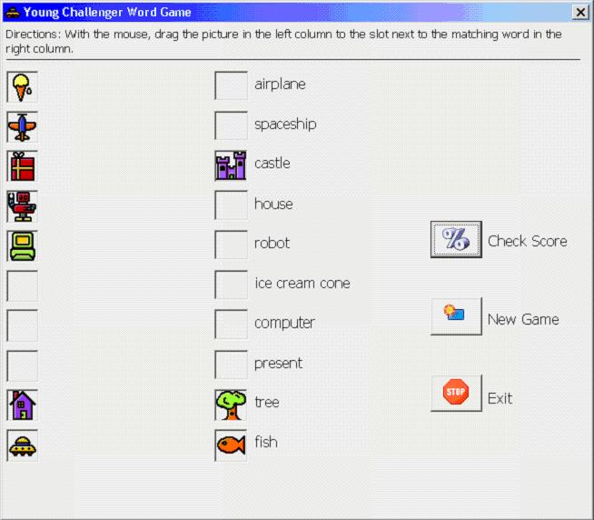



## Drag and Drop Demo/Tutorial

### Description

This is a basic demo on how to use drag and drop in a VB program. The vehicle for the demo is a child's game where the objective is to match a picture to the appropriate word. This is done by dragging the picture to the slot next to the correct word. The download includes the sample application, as well as a write-up describing the drag and drop features of VB and a step by step guide on how to build the sample application.
 
### More Info
 

             |
---                |---
**Submitted On**   |2006-09-19 20:11:22
**By**             |[TheVBPro](https://github.com/Planet-Source-Code/PSCIndex/blob/master/ByAuthor/thevbpro.md)
**Level**          |Intermediate
**User Rating**    |5.0 (25 globes from 5 users)
**Compatibility**  |VB 6\.0
**Category**       |[Miscellaneous](https://github.com/Planet-Source-Code/PSCIndex/blob/master/ByCategory/miscellaneous__1-1.md)
**World**          |[Visual Basic](https://github.com/Planet-Source-Code/PSCIndex/blob/master/ByWorld/visual-basic.md)
**Archive File**   |[Drag\_and\_D2020829192006\.zip](https://github.com/Planet-Source-Code/thevbpro-drag-and-drop-demo-tutorial__1-66604/archive/master.zip)

